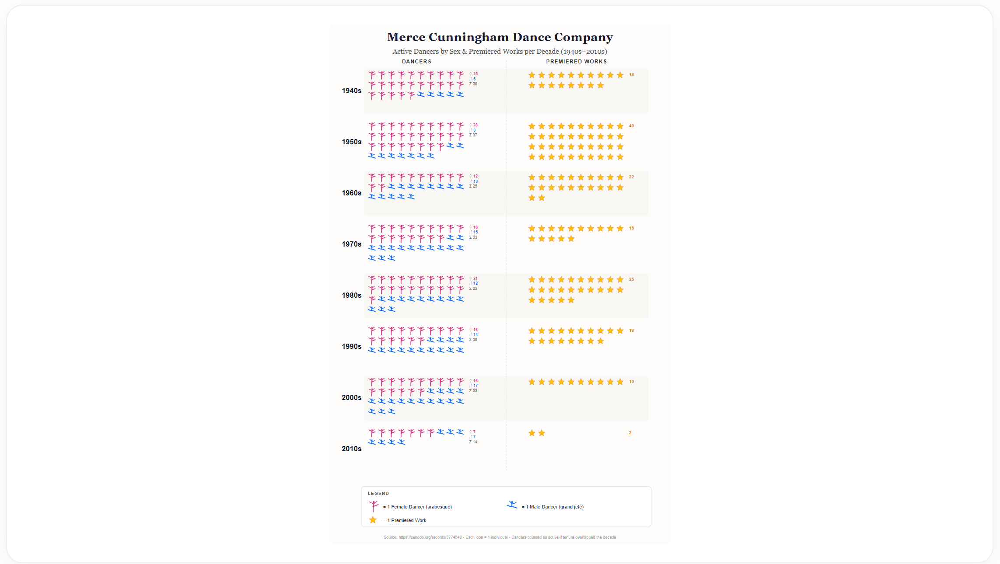

# Cunningham Pictogram

A small React, D3, and SVG learning visualization created in response to a 2026 [#30DayChartChallenge](https://30daychartchallenge.org/) prompt. It explores decade-level Cunningham dancer and work aggregates through custom silhouettes, stars, and repeated pictogram marks.

## Live demo

[View the Cunningham Pictogram](https://unguisdraconis.github.io/cunningham-pictogram/)



## Challenge context

This project belongs to Jeremiah King's broader Cunningham visualization experiments. Each artifact preserves a different response to a 2026 #30DayChartChallenge prompt; the specific day and prompt for this pictogram have not been recovered.

[`cunningham-3d`](https://github.com/unguisdraconis/cunningham-3d) is the principal visualization in the series. Supporting experiments include [`cunningham-marimekko`](https://github.com/unguisdraconis/cunningham-marimekko) and [`cunningham-slope`](https://github.com/unguisdraconis/cunningham-slope).

## What the visualization shows

Rows represent decades from the 1940s through the 2010s. Within this historical project aggregate:

- one pink female-dancer silhouette represents one stored female-dancer unit;
- one blue male-dancer silhouette represents one stored male-dancer unit;
- one yellow star represents one stored work unit.

The chart uses whole repeated symbols. Symbol count, rather than proportional symbol area, encodes each value.

## Data and provenance

The preserved source dataset is:

> Clarisse Bardiot. *Merce Cunningham*. Version 1. Zenodo. [doi:10.5281/zenodo.3774548](https://doi.org/10.5281/zenodo.3774548). Published April 28, 2020.

The dataset is licensed under [Creative Commons Attribution 4.0 International (CC BY 4.0)](https://creativecommons.org/licenses/by/4.0/). Byte-identical copies of the two Zenodo source files are preserved in [`cunningham data/`](cunningham%20data/), with checksums and acquisition context documented in the accompanying [source-data note](cunningham%20data/README.md).

## Transformation boundary

The application does not parse the preserved Zenodo files. Its decade values are hard-coded, and the original aggregation procedure is not preserved as executable code. The dancer source contains names and first/last recorded years but no sex field, so the stored female/male classification cannot be independently reconstructed from that file. Direct decade calculations from the preserved files also do not reproduce every displayed total.

The visualization is retained as a historical learning artifact, not presented as a fully reproducible analysis.

## Technical notes

- React provides the component and SVG lifecycle.
- D3 constructs and lays out the SVG marks.
- Custom dancer pictograms and programmatic stars form repeated-unit grids.

The deliberately simple, fixed-layout composition is preserved as part of the project's learning-stage evidence.

## Accessibility

The SVG has an accessible name and description. A visually secondary semantic table provides the exact stored female, male, dancer-total, and work values for every decade without making individual pictogram marks focusable.

## Local use

```text
npm ci
npm run dev
npm run lint
npm run build
```

## Licensing

- **Dataset:** CC BY 4.0 under the Zenodo record cited above.
- **Application software:** No separate software license is currently specified.
